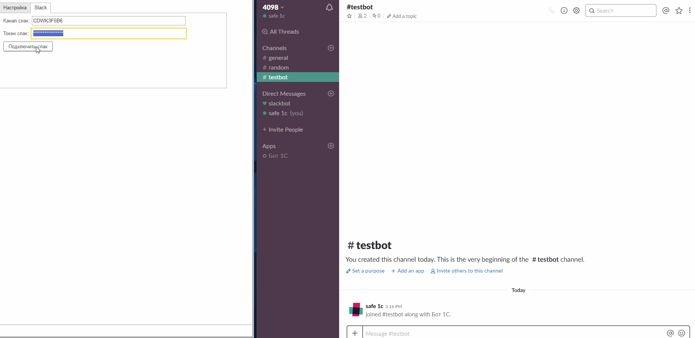

.. _sphinx-chapter:
   
.. meta::
    :description: Примеры использования компонента WebSocket 1C
    :keywords: websocket, примеры, slack

.. meta::
    :http-equiv=Content-Type: text/html; charset=utf-8

=======================================
Примеры использования
=======================================

slack bot
~~~~~~~~~~~~~

Пример реализации бота, который получает сообщений, отправленные пользователями в Slack `Подробнее`_

.. _`Подробнее`: https://api.slack.com/rtm

Для реализации требуется token Slack (подробнее на просторах интернета)

При подключении бот отправляет приветственное сообщение и отображает в 1С сообщения из чата.

.. index:: slack
.. function:: SlackBot()
        
    Описание: Пример бота Slack с постоянным подключения и отслеживанием событий
    
.. code-block:: bsl
   :linenos:

    // Запустить процедуру отправить сообщение в канал
    Процедура SlackBot()

        ПутьККомпоненте = "c:/websocket.dll";
        ИДКанала = "C23535436TR";                
        ТокенСлак = "xora-3234234324....";
        
        Заголовки = Новый Соответствие;
        Заголовки.Вставить("Authorization", "Bearer " + ТокенСлак);
        
        Запрос = Новый HTTPЗапрос("api/rtm.connect", Заголовки);
        
        Соединение = Новый HTTPСоединение("slack.com",,,,,, Новый ЗащищенноеСоединениеOpenSSL);
        
        Ответ = Соединение.Получить(Запрос);
        
        Если НЕ Ответ.КодСостояния = 200 Тогда
            ВызватьИсключение "Не верный ответ"; 
        КонецЕсли;
        
        Данные =  ПолучитьЗначениеИзОтветаJSON(Ответ.ПолучитьТелоКакСтроку());
        
        урл = Данные.Получить("url");
        
        Если НЕ ЗначениеЗаполнено(урл) Тогда
            ВызватьИсключение "Нет адреса подключения";
        КонецЕсли;
        
        #Если Не Сервер Тогда
        //УстановитьВнешнююКомпоненту(ПутьККомпоненте);
        #КонецЕсли
        
        Если НЕ ПодключитьВнешнююКомпоненту(ПутьККомпоненте, "WebSocket", ТипВнешнейКомпоненты.Native) Тогда
            СисИнфо = Новый СистемнаяИнформация;
            ОписаниеОшибки = НСтр("ru='Ошибка подключения компоненты ('") + СисИнфо.ТипПлатформы + "):
            |" + ОписаниеОшибки();
            
            ВызватьИсключение ОписаниеОшибки;
        КонецЕсли;

        Клиент = Новый("AddIn.WebSocket.Client");	
        
        ТекстСообщения = ПолучитьСтрокуJSON(Новый Структура("type, channel, text", "message", ИДКанала, "Listen for 1C Enterprise"));
        
        Попытка
            Клиент.Подключиться(урл);				
        Исключение
            
            Описание = ОписаниеОшибки();
            ТекстОшибки =  Клиент.ОписаниеОшибки();
            
            ТекстОписания = Описание + ": " + ТекстОшибки;
            
            ВызватьИсключение ТекстОписания;
            
        КонецПопытки;
        
       	Данные = "";
	
        ГотовПринимать = Ложь;
        
        Пока Клиент.Принять(0, Данные) Цикл 
            
            Значение = ПолучитьЗначениеИзОтветаJSON(Данные);
            
            Текст = Значение.Получить("text");
            
            Если Значение.Получить("type") = "hello" Тогда
                Клиент.Отправить(ТекстСообщения);
                ГотовПринимать = Истина;
            КонецЕсли;
            
            Если Текст = Неопределено ИЛИ НЕ Значение.Получить("reply_to") = Неопределено ИЛИ НЕ ГотовПринимать Тогда
                Продолжить;
            КонецЕсли;
            
            Если НРег(Текст) = НРег("go away!") ИЛИ НРег(Текст) = НРег("11") Тогда
                
                ТекстСообщения = ПолучитьСтрокуJSON(Новый Структура("type, channel, text", "message", ИДКанала, "ok. bye-bye )))"));
                Клиент.Отправить(ТекстСообщения);
                
                Сообщить("Меня отключили");
                Прервать;
                
            КонецЕсли;
            
            Сообщить(Текст);
                
            ТекстСообщения = ПолучитьСтрокуJSON(Новый Структура("type, channel, text", "message", ИДКанала, "Получил: "+ Текст));
            Клиент.Отправить(ТекстСообщения);
            
        КонецЦикла;
        
        Клиент.Отключиться();
        
        //Клиент = Неопределено;

        
    КонецПроцедуры

    Функция ПолучитьЗначениеИзОтветаJSON(ТекстJSON) Экспорт 
        
        ЧтениеJSON	= Новый ЧтениеJSON;
        
        ЧтениеJSON.УстановитьСтроку(ТекстJSON);
        
        Значение	= ПрочитатьJSON(ЧтениеJSON, Истина);
        
        Возврат Значение;
        
    КонецФункции

    Функция ПолучитьСтрокуJSON(Значение) Экспорт 
        
        ЗаписьJSON = Новый ЗаписьJSON;
        ЗаписьJSON.УстановитьСтроку();
        ЗаписатьJSON(ЗаписьJSON, Значение);
        
        Возврат ЗаписьJSON.Закрыть();
        
    КонецФункции

web client (html/js)
~~~~~~~~~~~~~~~~~~~~~~~~~~

Пример реалзации websocket клиента в ПолеHTMLДокумента или на web-странице корпоративного портала

.. index:: html/js
.. function:: html_client()
        
    Описание: web-страницы для подключения к 1С
    
.. code-block:: html
   :linenos:

    <!DOCTYPE html>
    <meta charset="utf-8" />
    <title>WebSocket Test</title>
    

    <h2>WebSocket Test</h2>

    

